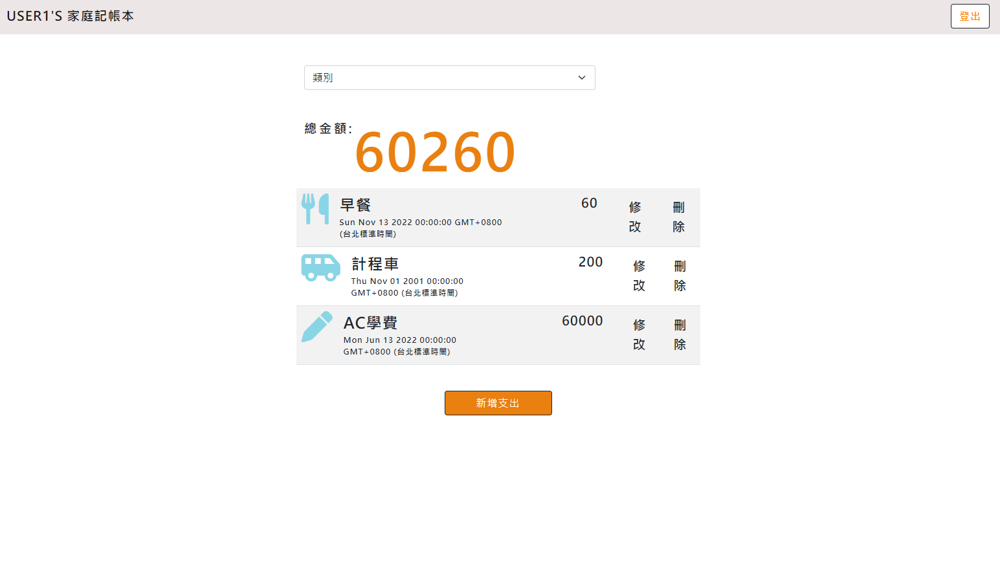

# Expense Tracker



## About

A tool to keep track of your expenses.

### Functions

- Register with an personal account
  - User login/logout
  - Authentication
- Show list of all users expenses in index page
- Show total expenses of user
- Add new expense entries
- Edit type of expense
- Delete an expense
- Filter expense by type and show subtotal

## Installation

1. Check if node.js and npm is installed
2. Clone project to local 
3. Navigate to the project folder via the terminal, then install：

   ```bash
   npm install
   ```

4. Set MongoDB URI at local evironmental constant:

   ```bash
   export MONGODB_URI2="mongodb+srv://<your_account>:<your_password>@cluster0.j9qlz5q.mongodb.net/restaurant-list?retryWrites=true&w=majority"
   ```
5. Run seeder: 

   ```bash
   npm run seed
   ```

6. Then：

   ```bash
   npm run start
   ```

7. If the code is running successfully(see message below), open your browser and go to http://localhost:3000

   ```bash
   Listening on http://localhost:3000
   mongodb connected!
   ```

8. To stop the program:

   ```bash
   ctrl + c
   ```

## Tools

- Node.js 14.16.0
- Express 4.16.4
- Express-Handlebars 3.0.0
- Bootstrap 5.2.0
- Font-awesome 6.1.2
- mongoDB 4.9.1
- mongoose 5.13.15
- method-override 3.0.0
- passport 0.4.1
- passport-facebook 3.0.0
- passport-local 1.0.0
- express-session 1.17.1
- bcryptjs 2.4.3
- connect-flash 0.1.1
- dotenv 16.0.3